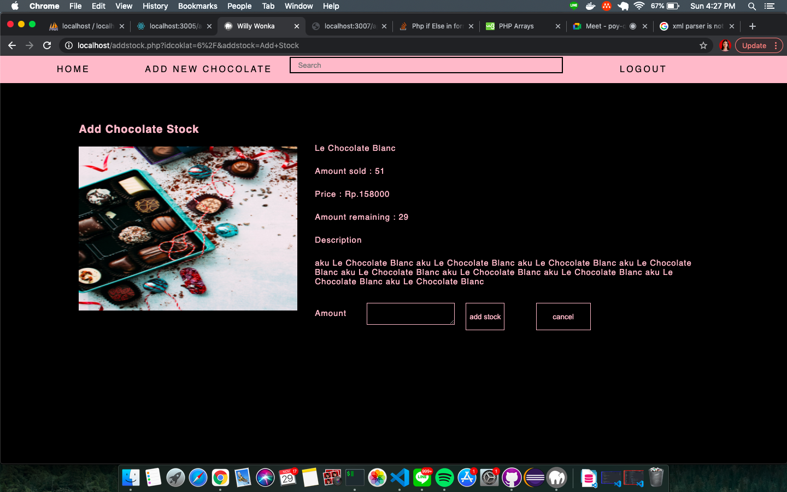
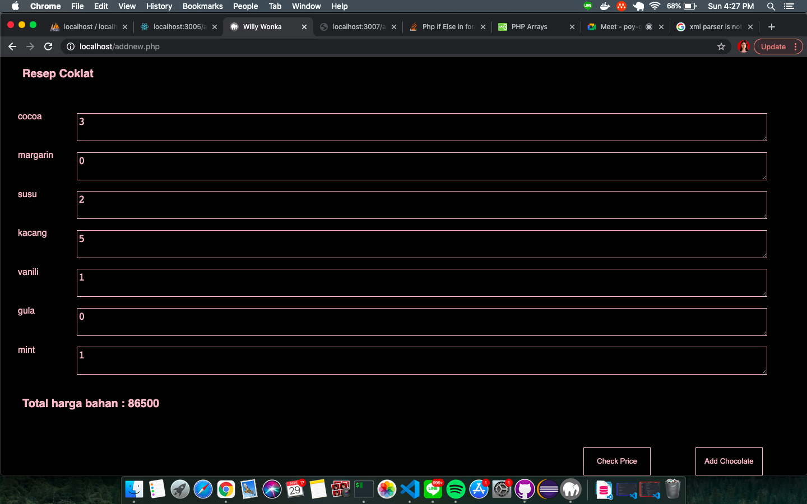

# Tugas 1 IF3110 Pengembangan Aplikasi Berbasis Web

## Deskripsi Singkat

Anda mungkin sudah tahu mengenai pabrik coklat terbesar seantero dunia, Willy Wangky.
Akan tetapi, produsen terbaik tidak akan sukses tanpa konsumen dan distributor terbaik.
Sebab coklat dari Willy Wangky sangat disenangi konsumen, maka Willy Wangky membutuhkan distributor yang handal dalam menangani penjualan coklat.
Untungnya, Willy Wangky mengenal Jan.
Jan sudah sangat pengalaman dengan distribusi makanan dan minuman ringan.
Bahkan, Jan sudah memiliki usaha sendiri bernama Jan’s Cook.

Willy Wangky pun meminta Jan untuk memberikan saran bagaimana cara menjual coklat-coklat miliknya pada konsumen.
Apalagi di tengah pandemi seperti ini, beberapa toko penjualan sepi dikunjungi pengunjung.
Jan tanpa pikir panjang, memberikan saran mengenai penjualan daring menggunakan aplikasi berbasis web.
Willy Wangky sangat senang dengan hal ini, dan segera mengutus Jan untuk mencari programmer terbaik untuk pengembangannya.

Willy Wangky menginginkan web tersebut agar penggunanya dapat melakukan pendaftaran akun, login, logout, pencarian produk, mendapatkan penjelasan produk secara detail, pembelian produk dan dapat melihat riwayat pembelian produk, dan pekerjanya dapat dengan mudah menambahkan jenis coklat baru yang ingin dijual serta menambah ketersediaan coklat.

Jan telah membuat desain user interface dengan low fidelity.
Sekarang, dia merekrut kalian untuk membuat sebuah aplikasi web yang membantu penjualan coklat milik Willy Wangky.
Disebabkan Jan sangat percaya dengan kalian, maka web yang kalian kembangkan dapat kalian hias dengan sebaik mungkin.
Perlu diingat bahwa tata letak komponen harus mengikuti desain dari Jan.

## Daftar Requirement

- Browser yang bisa menjalankan ajax :
  Mozilla Firefox 1.0 and above.
  Netscape version 7.1 and above.
  Apple Safari 1.2 and above.
  Microsoft Internet Explorer 5 and above.
  Konqueror.
  Opera 7.6 and above.

- Web Server (MAMP, XAMPP, etc) : Apache & MySQL

## Cara Instalasi

1. install MAMP/ XAMPP/ sejenis
2. in mamp preferences choose web server, select folder tugas-besar-1-2020

## Cara Menjalankan Server

1. start server (make sure mysql & apache server is on)
2. open localhost/index.php
3. pastikan server ws supplier dan ws factory sudah nyala

## Perubahan database

terdapat tambahan kolom deliver TINYINT(1) NOT NULL untuk menandakan status req stock dari ww factory

## Screenshot perubahan pada tampilan aplikasi

### Perubahan pada Page Add Stock

### Perubahan pada Page New Stock

## Pembagian Tugas

### REST

1. Melakukan transaksi bahan dengan Factory Management Pro.
   a ) Input yang diberikan adalah jumlah uang yang dimiliki, daftar bahan yang ingin dibeli beserta jumlahnya. : 13518027
   b ) Apabila uang cukup, layanan memberikan respon jumlah uang hasil transaksi beserta status berhasil. : 13518038
   c ) Apabila uang tidak cukup, layanan memberikan respon jumlah uang yang kurang agar transaksi berhasil beserta status gagal. : 13518038
2. Memberikan daftar bahan yang dijual.
   Menerima request dari Factory Management Pro. : 13518001
   Mengembalikan data berisi daftar bahan-bahan yang ada. Bisa beserta harga dan bisa tanpa harga. : 13518001

### SOAP

1. Menambahkan jenis coklat baru beserta resep (kebutuhan bahan) dan harganya. : 13518001
2. Menambahkan permintaan add stock baru. : 13518001
3. Mengembalikan status dari permintaan add stock. : 13518038, 13518027
4. Melakukan pembuatan coklat tertentu dengan jumlah tertentu, yaitu mengubah bahan tidak kedaluwarsa dalam stok gudang Factory : 13518027
5. menjadi coklat (yang masih berada dalam gudang Factory) dan mengurangi bahan dalam gudang apabila bahan cukup. : 13518027
6. Mengubah status permintaan add stock, dalam artian melakukan pengiriman terhadap toko Willy Wangky. : 13518027
7. Menambah saldo yang dimiliki pada Factory. : 13518027
8. Mengembalikan saldo yang dimiliki pada Factory. : 13518038
9. Menambahkan bahan dalam gudang. : 13518038
10. Mengembalikan list Resep : 13518001, 13518038
11. Mengembalikan list coklat beserta resepnya : 13518001, 13518038
12. Mengembalikan list bahan yang ada pada factory : 13518027, 13518038

### ReactJS

1. Login : 13518001
2. Navigation dashboard : 13518038
3. approval pesanan : 1318038
4. Melihat daftar pemesanan coklat dari WWWeb : 13518027
5. Melihat daftar bahan yang tersedia di pabrik : 13518027
6. Melihat daftar harga bahan yang tersedia di supplier : 13518038
7. Membeli bahan dari supplier : 13518038
8. Melihat daftar resep coklat : 13518001
9. Melihat daftar coklat yang tersedia di pabrik : 13518001
10. Melihat saldo pabrik : 13518001

### Perubahan pada willy wangky web

1. Request add stock ke ws factory : 13518001
2. Pengecekan status req add stock ke ws factory : 13518027
3. input resep pada add new chocolate dan menampilkan total harga bahan : 13518001
4. mengirim req resep coklat ke ws factory : 13518001
5. Setiap penjualan coklat, aplikasi harus memanggil request pada web service Factory untuk menambah saldo. : 13518001, 13518038

### Skenario tambahan

1. Penambahan stok coklat : 13518001
2. Penambahan jenis coklat baru : 13518001

## About

- 13518001 - Chandrika Azharyanti
- 13518027 - Jundullah
- 13518038 - Inka Anindya Riyadi
